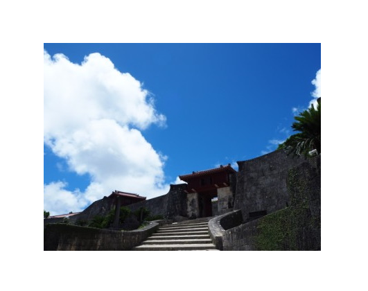
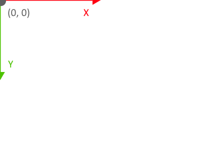
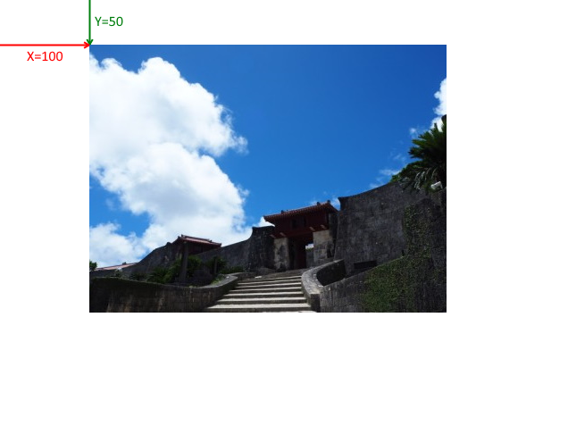
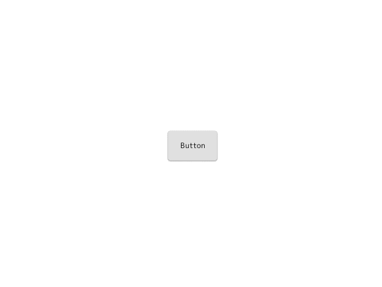

GUI を作る
==========

この章では、2D 座標系上に画像やボタンを表示する方法を学びます。

2D 画像 (2D スプライト) を表示する
----------

まずは画像を表示してみましょう。

以前の章で 3D 空間にスプライトを表示しましたが、今回は `UISprite` を使います。

<!-- -------------------------------------------------------------------------------- -->
# [C++](#tab/lang-cpp)
```cpp
#include <Lumino.hpp>

class App : public Application
{
    void onInit() override
    {
        auto texture = Texture2D::load(u"picture1.jpg");
        auto sprite = UISprite::create(texture);
        sprite->addInto();
    }
};

LUMINO_APP(App);
```
# [Ruby](#tab/lang-ruby)
```ruby
require "lumino"

class App < Application
  def on_init
    texture = Texture2D.load("picture1.jpg")
    sprite = UISprite.new(texture)
    sprite.add_into
  end
end

App.new.run
```
# [HSP3](#tab/lang-hsp3)
```c
#include "lumino.as"
LUMINO_APP

*on_init
    LNTexture2D_Load "picture1.jpg", texture
    LNUISprite_CreateWithTexture texture, sprite
    LNUIElement_AddInto sprite
    return

*on_update
    return
```
---
<!-- -------------------------------------------------------------------------------- -->



画像がウィンドウの中央に表示されました。

画像を 2D 空間に表示する UISprite は、3D の時のような奥行きの計算はされませんので、元の画像と同じサイズで表示されます。

ところで、以前の章では 2D 座標系は次のようにウィンドウの左上を原点とすることを学びました。



しかし UISprite には特に座標を設定していませんが、センタリングされています。

この原点の仕組みを理解するため、次はレイアウトについて説明します。


レイアウトと座標について
----------

`UISprite` やこの後紹介する `UIButton` など、2D 座標上に配置してエンドユーザーに情報を伝えるためのものを `UIElement` と呼びます。

UIElement は [CSS](https://ja.wikipedia.org/wiki/Cascading_Style_Sheets) ライクなレイアウトシステムを持っており、
座標を直接指定するよりも、「左揃え、中央揃え」といった `Alignment` や余白を表す `Margin`, `Padding` を使って配置していきます。

これによって、ウィンドウサイズを変えたり UIElement をアニメーションさせたときでも破綻しにくい GUI を構築できるようになります。

さて、そのような UIElement ですが、デフォルトの Alignment は「中央揃え」になっています。

次のプログラムでは座標の変化をイメージするために、左上を原点として座標を設定してみます。

<!-- -------------------------------------------------------------------------------- -->
# [C++](#tab/lang-cpp)
```cpp
#include <Lumino.hpp>

class App : public Application
{
    void onInit() override
    {
        auto texture = Texture2D::load(u"picture1.jpg");
        auto sprite = UISprite::create(texture);
        sprite->setAlignments(UIHAlignment::Left, UIVAlignment::Top);
        sprite->setPosition(100, 50);
        sprite->addInto();
    }
};

LUMINO_APP(App);
```
# [Ruby](#tab/lang-ruby)
```ruby
require "lumino"

class App < Application
  def on_init
    texture = Texture2D.load("picture1.jpg")
    sprite = UISprite.new(texture)
    sprite.set_alignments(UIHAlignment::LEFT, UIVAlignment::TOP);
    sprite.set_position(100, 50);
    sprite.add_into
  end
end

App.new.run
```
# [HSP3](#tab/lang-hsp3)
```c
#include "lumino.as"
LUMINO_APP

*on_init
    LNTexture2D_Load "picture1.jpg", texture
    LNUISprite_CreateWithTexture texture, sprite
    LNUIElement_SetAlignments sprite, LN_UIHALIGNMENT_LEFT, LN_UIVALIGNMENT_TOP
    LNUIElement_SetPositionXYZ sprite, 100, 50
    LNUIElement_AddInto sprite
    return

*on_update
    return
```
---
<!-- -------------------------------------------------------------------------------- -->




ボタン
----------

ボタンは、マウスクリックやタップ操作に反応する UIElement です。

あらかじめ処理を登録しておくことで、クリックやタップ操作といった `イベント` が発生したときに、その処理を実行します。

<!-- -------------------------------------------------------------------------------- -->
# [C++](#tab/lang-cpp)
```cpp
#include <Lumino.hpp>

class App : public Application
{
    void onInit() override
    {
        auto button = UIButton::create(u"Button");
        button->connectOnClicked([]() {
            Debug::printf(u"Hello, UI!");
        });
        button->addInto();
    }
};

LUMINO_APP(App);
```
# [Ruby](#tab/lang-ruby)
```ruby
require "lumino"

class App < Application
  def on_init
    button = UIButton.new("Button")
    button.connect_on_clicked do
      Debug.print("Hello, UI!")
    end
    button.add_into
  end
end

App.new.run
```
# [HSP3](#tab/lang-hsp3)
```c
#include "lumino.as"
LUMINO_APP

*on_init
    LNUIButton_CreateWithText "Button", btn
    LNUIButton_ConnectOnClicked btn, *clicked
    LNUIElement_AddInto btn
    return

*on_update
    return

*clicked
    LNDebug_Print "Hsello, UI!"
    return
```
---
<!-- -------------------------------------------------------------------------------- -->



