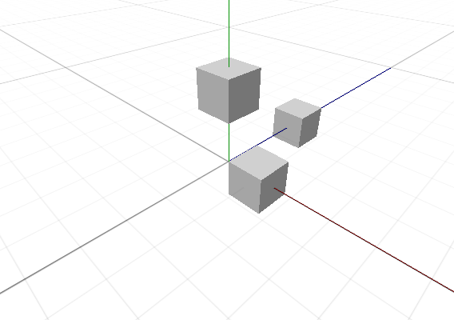
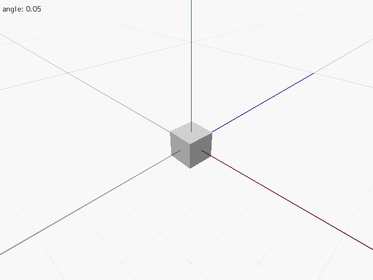

オブジェクトを動かす
==========

この章では、3D 空間内のオブジェクトの姿勢を設定する方法について学びます。

移動する
----------

# [C++](#tab/lang-cpp)
```cpp
#include <Lumino.hpp>

class App : public Application
{
    void onInit() override
    {
        Engine::renderView()->setGuideGridEnabled(true);
        Engine::camera()->setPosition(5, 5, -5);
        Engine::camera()->lookAt(0, 0, 0);

        auto box1 = BoxMesh::With().buildInto();
        box1->setPosition(1, 0, 0);
            
        auto box2 = BoxMesh::With().buildInto();
        box2->setPosition(0, 2, 0);

        auto box3 = BoxMesh::With().buildInto();
        box3->setPosition(0, 0, 3);
    }
};

LUMINO_APP(App);
```
# [Ruby](#tab/lang-ruby)
```ruby
require "lumino"

class App < Application
    def on_init
        Engine.render_view.guide_grid_enabled = true
        Engine.camera.set_position(5, 5, -5)
        Engine.camera.look_at(0, 0, 0)
        
        box1 = BoxMesh.new
        box1.set_position(1, 0, 0)
        box1.add_into

        box2 = BoxMesh.new
        box2.set_position(0, 2, 0)
        box2.add_into

        box3 = BoxMesh.new
        box3.set_position(0, 0, 3)
        box3.add_into
    end
end

App.new.run
```

---



回転する
----------

# [C++](#tab/lang-cpp)
```cpp
#include <Lumino.hpp>

class App : public Application
{
    Ref<BoxMesh> box;

    void onInit() override
    {
        Engine::renderView()->setGuideGridEnabled(true);
        Engine::camera()->setPosition(5, 5, -5);
        Engine::camera()->lookAt(0, 0, 0);

        box = BoxMesh::With().buildInto();
    }

    void onUpdate() override
    {
        float r = Mouse::position().x / 100;

        box->setRotation(0, r, 0);
        
        Debug::printf(0, u"angle: {0}", r);
    }
};

LUMINO_APP(App);
```
# [Ruby](#tab/lang-ruby)
```ruby
require "lumino"

class App < Application
    def on_init
        Engine.render_view.guide_grid_enabled = true
        Engine.camera.set_position(5, 5, -5)
        Engine.camera.look_at(0, 0, 0)
        
        @box = BoxMesh.new
        @box.add_into
    end
    
    def on_update
        r = Mouse.position.x / 100
        
        @box.set_rotation(0, r, 0)
            
        Debug.print(0, "angle: %f" % r)
    end
end

App.new.run
```

---




拡大・縮小する
----------

# [C++](#tab/lang-cpp)
```cpp
#include <Lumino.hpp>

class App : public Application
{
    Ref<BoxMesh> box;

    void onInit() override
    {
        Engine::renderView()->setGuideGridEnabled(true);
        Engine::camera()->setPosition(5, 5, -5);
        Engine::camera()->lookAt(0, 0, 0);

        box = BoxMesh::With().buildInto();
    }

    void onUpdate() override
    {
        float s = Mouse::position().y / 100;

        box->setScale(s);
        
        Debug::printf(0, u"scale: {0}", s);
    }
};

LUMINO_APP(App);
```
# [Ruby](#tab/lang-ruby)
```ruby
require "lumino"

class App < Application
    def on_init
        Engine.render_view.guide_grid_enabled = true
        Engine.camera.set_position(5, 5, -5)
        Engine.camera.look_at(0, 0, 0)
        
        @box = BoxMesh.new
        @box.add_into
    end
    
    def on_update
        s = Mouse.position.y / 100
        
        @box.set_scale(s)
            
        Debug.print(0, "scale: %f" % s)
    end
end

App.new.run
```

---


ワールドへの追加と除外
----------

TODO:

子オブジェクトの追加と除外
----------

TODO:

オブジェクトの破棄
----------

TODO:

