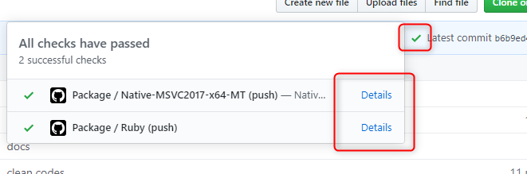

ダウンロード
==========

最新リリース (0.10.0)
----------

<a href="http://nnmy.sakura.ne.jp/archive/lumino/v0.10.0/Lumino-v0.10.0-Windows.msi" class="button">
  <i class="glyphicon glyphicon-download"></i>C++ (Windows Installer)
</a>

<a href="http://nnmy.sakura.ne.jp/archive/lumino/v0.10.0/Lumino-v0.10.0-Windows.zip" class="button">
  <i class="glyphicon glyphicon-download"></i>C++ (Windows, ZIP archive)
</a>

<a href="http://nnmy.sakura.ne.jp/archive/lumino/v0.10.0/Lumino-v0.10.0-HSP3.zip" class="button">
  <i class="glyphicon glyphicon-download"></i>HSP3 (Windows, ZIP archive)
</a>

上記以外のパッケージは [現在開発中の最新ビルド](#現在開発中の最新ビルド) を参照してください。

なお v0.10.0 では OpenGL サポートを外しているため、macOS, iOS, Web プラットフォームではグラフィックス機能を利用することはできません。

現在開発中の最新ビルド
----------

リポジトリの GitHub Actions に紐づけられている Artifacts よりダウンロードできます。

[リポジトリのページ](https://github.com/LuminoEngine/Lumino)を開き、✔ マーク > Details > Artifacts から選択してください。

古いリリース
----------

### 0.9.0

<a href="http://nnmy.sakura.ne.jp/archive/lumino/v0.9.0/Lumino-v0.9.0-Windows.msi" class="button">
  <i class="glyphicon glyphicon-download"></i>Windows (Installer)
</a>

<a href="http://nnmy.sakura.ne.jp/archive/lumino/v0.9.0/Lumino-v0.9.0-Windows.zip" class="button">
  <i class="glyphicon glyphicon-download"></i>Windows (ZIP archive)
</a>

<a href="http://nnmy.sakura.ne.jp/archive/lumino/v0.9.0/Lumino-v0.9.0-macOS.zip" class="button">
  <i class="glyphicon glyphicon-download"></i>macOS (ZIP archive)
</a>

### 0.8.0

<a href="http://nnmy.sakura.ne.jp/archive/lumino/v0.8.0/Lumino-0.8.0-Windows.msi" class="button">
  <i class="glyphicon glyphicon-download"></i>Windows (Installer)
</a>

<a href="http://nnmy.sakura.ne.jp/archive/lumino/v0.8.0/Lumino-0.8.0-Windows.zip" class="button">
  <i class="glyphicon glyphicon-download"></i>Windows (ZIP archive)
</a>

<a href="http://nnmy.sakura.ne.jp/archive/lumino/v0.8.0/Lumino-0.8.0-macOS.zip" class="button">
  <i class="glyphicon glyphicon-download"></i>macOS (ZIP archive)
</a>

### v0.7.0

<a href="http://nnmy.sakura.ne.jp/archive/lumino/0.7.0/Lumino-0.7.0-Windows.msi" class="button">
  <i class="glyphicon glyphicon-download"></i>Windows (Installer)
</a>

<a href="http://nnmy.sakura.ne.jp/archive/lumino/0.7.0/Lumino-0.7.0-Windows.zip" class="button">
  <i class="glyphicon glyphicon-download"></i>Windows (ZIP archive)
</a>

<a href="http://nnmy.sakura.ne.jp/archive/lumino/0.7.0/Lumino-0.7.0-macOS.zip" class="button">
  <i class="glyphicon glyphicon-download"></i>macOS (ZIP archive)
</a>

### v0.6.0

<a href="http://nnmy.sakura.ne.jp/archive/lumino/0.6.0/Lumino-0.6.0-Windows.msi" class="button">
  <i class="glyphicon glyphicon-download"></i>Windows (Installer)
</a>

<a href="http://nnmy.sakura.ne.jp/archive/lumino/0.6.0/Lumino-0.6.0-Windows.zip" class="button">
  <i class="glyphicon glyphicon-download"></i>Windows (ZIP archive)
</a>

<a href="http://nnmy.sakura.ne.jp/archive/lumino/0.6.0/Lumino-0.6.0-macOS.zip" class="button">
  <i class="glyphicon glyphicon-download"></i>macOS (ZIP archive)
</a>
