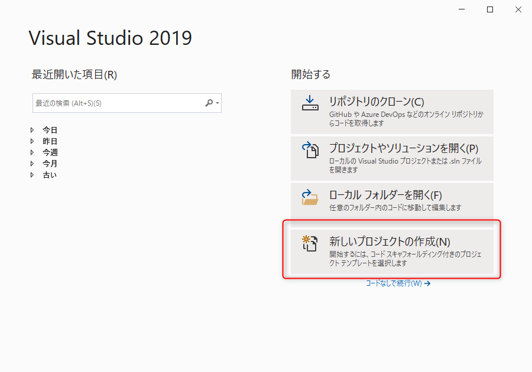
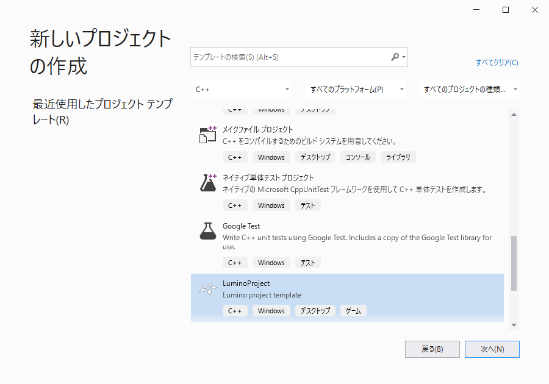
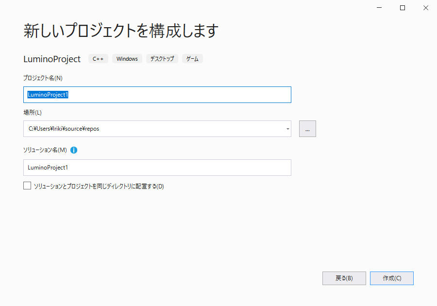

C++ で Lumino をはじめる
==========

> [!Note]
> このページでは Windows で開発を始める手順を説明しています。macOS についてはまだ書かれていません。

開発環境の準備を行う
--------

### Visual Studio をインストールする

1. [Visual Studio の Web ページ](https://visualstudio.microsoft.com/ja/downloads/) から Visual Studio 2019 Community をダウンロードし、インストールしてください。
2. Visual Studio インストーラーを実行して C++ 開発ツール（C++ によるデスクトップ開発）をインストールします。

### Lumino をインストールする

1. [Lumino のインストーラ](https://github.com/LuminoEngine/Lumino/releases/download/v0.10.0/Lumino-v0.10.0-Windows.msi) をダウンロードし、実行してください。インストーラの指示に従ってインストールを行います。
2. 実行時に Windows SmartScreen の注意メッセージが表示された場合は「詳細情報」→「実行」を押してください。

プロジェクトを作成して実行する
--------

1. Visual Studio 2019 を起動し、 [新しいプロジェクトの作成] をクリックします。 
2. プロジェクト テンプレートのリストから `LuminoProject` を選択し、 [次へ] をクリックします。 
3. プロジェクト名と保存場所を入力し、[作成] をクリックします。 
4. プロジェクトが作成され、サンプルプログラムが表示されます。
5. [デバッグ] メニューの [デバッグの開始] からからプログラムを実行します。

中央に "Hello, Lumino!" と書かれたウィンドウが表示されましたか？

これで Lumino を使うための準備が整いました。次は [チュートリアル](../first-tutorial/1-basic.md) に進みましょう！

