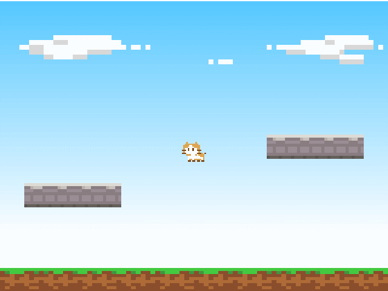

物理演算
==========

アクションゲームではジャンプや衝撃、衝突など、ワールド内のオブジェクトを物理特性によって制御するケースがたくさんあります。
しかし、自然な動きをイチから実装することは簡単ではありません。

Lumino では、スプライトなどワールド内のオブジェクトにいくつかの物理設定を行うことで、自然な動きを表現できるようになります。


プレイヤーに剛体を追加する
----------

剛体とは物理演算を構成する要素のひとつで、物体の性質や姿勢を表現します。

まずはプレイヤーのスプライトに剛体を追加し、自由落下させてみましょう。

プレイヤーのスプライトを作成した後に、次のコードを追加します。

```cpp
Ref<RigidBody2DComponent> playerBody = RigidBody2DComponent::create();
playerBody->addCollisionShape(BoxCollisionShape2D::create(1, 1));
playerBody->setMass(2);
playerBody->setFixedRotation(true);
playerSprite->addComponent(playerBody);
```

また、プレイヤーの移動処理は物理演算のシステムに任せるため、前回のチュートリアルで作成したプログラムから移動部分を削除しておきます。


```diff
- float x = 0.0f;

while (Engine::update())
{
    if (Input::isPressed(u"left"))
    {
-        x -= 0.1f;
    }

    if (Input::isPressed(u"right"))
    {
-        x += 0.1f;
    }

-    playerSprite->setPosition(x, 0);
}
```

プレイヤーは落下するようになりましたが、画面外へ落ちてしまうはずです。


これは次のセクションで地面にも剛体を追加することで解決しますが、まずはコードの説明をします。


### ワールドオブジェクトとコンポーネント

Lumino では、キャラクター、アイテム、背景など、ゲーム内のすべてのオブジェクトは `ワールドオブジェクト` と呼びます。

ワールドオブジェクト単独ではできることはほとんどありません。スプライトを表示したり、特殊効果を表現するには `コンポーネント` と呼ばれる「部品」を取り付け、それらを調整・制御する必要があります。

なお、この取り付ける操作のことをアタッチ(attach)すると言い、取り外す操作のことをデタッチ(detach)すると言います。


### スプライトに剛体をアタッチする

これまで何度も使ってきた Sprite もワールドオブジェクトのひとつです。

これに対して剛体コンポーネント (RigidBody2DComponent) をアタッチすることで、スプライトに物理的な動作をさせることができます。

```cpp
Ref<RigidBody2DComponent> playerBody = RigidBody2DComponent::create();
playerSprite->addComponent(playerBody);
```


### 剛体の設定

剛体は物理演算のために、質量、摩擦、跳ね返りなど非常に多くのパラメータを持っています。

リアルな値を使うほど現実的な動きをさせることができますが、ゲームとして「それらしく」動かすだけであればそれほど難しくとらえる必要はありません。

まず、衝突判定のための形状を追加しています。
次のコードは、幅1、高さ1 (プレイヤーのスプライトと同じ大きさ) の四角形の形状 (BoxCollisionShape2D) を作成し、プレイヤーの剛体に追加しています。

```
playerBody->addCollisionShape(BoxCollisionShape2D::create(1, 1));
```

続いて質量を キログラム(kg) 単位で設定します。今回のキャラクターは「猫」ということで、2kg としています。（ちょっと軽いかもしれませんが）

```
playerBody->setMass(2);
```

最後に、今回のゲームではオブジェクトの位置についてのみ物理演算を適用したいため、物理演算によって剛体が回転しないようにしています。

```
playerBody->setFixedRotation(true);
```


地形に静的な剛体を追加する
----------

今はプレイヤーが画面外に落下してしまいますが、地形に対しても剛体をアタッチすることで、プレイヤーが地面の上に立つことができるようにします。

地面のスプライトを作成した後に、次のコードを追加します。

```cpp
// 地面の剛体
Ref<RigidBody2DComponent> groundBody = RigidBody2DComponent::create();
groundBody->addCollisionShape(BoxCollisionShape2D::create(16, 1));
groundSprite->addComponent(groundBody);
```



プレイヤーが地面の上に立つようになりました。


### 静的な剛体とは？

静的な剛体とは、物理演算によって移動しない剛体です。今回のような動かない地形などにアタッチすることで、プレイヤーのような動く剛体 (動的な剛体) の動きを制限したりできます。

Lumino では質量が 0 である剛体は静的な剛体とみなされます。RigidBody2DComponent::create() で作成した剛体のデフォルトの質量は 0 であるため、作成するだけでそれは静的な剛体となります。

### 床の剛体を追加しておく

床もまた、地面と同じように地形の一部です。これらにも静的な剛体を追加しておきます。

床のスプライトを作成した後に、次のコードを追加します。

```cpp
// 左の床の剛体
Ref<RigidBody2DComponent> floorBody1 = RigidBody2DComponent::create();
floorBody1->addCollisionShape(BoxCollisionShape2D::create(4, 1));
floorSprite1->addComponent(floorBody1);
```

```cpp
// 右の床の剛体
Ref<RigidBody2DComponent> floorBody2 = RigidBody2DComponent::create();
floorBody2->addCollisionShape(BoxCollisionShape2D::create(4, 1));
floorSprite2->addComponent(floorBody2);
```


コード全体
----------

```cpp
#include <Lumino.hpp>

void Main()
{
    // ワールドの 16x12 の範囲を表示する
    Camera* camera = Engine::mainCamera();
    camera->setProjectionMode(ProjectionMode::Orthographic);
    camera->setOrthographicSize(16, 12);

    // 空
    Ref<Texture> skyTexture = Assets::loadTexture(u"sky");
    Ref<Sprite> skySprite = Sprite::create(skyTexture, 16, 12);

    // 地面
    Ref<Texture> mapTexture = Assets::loadTexture(u"map");
    Ref<Sprite> groundSprite = Sprite::create(mapTexture, 16, 1);
    groundSprite->setSourceRect(0, 0, 80, 8);
    groundSprite->setPosition(0, -5.5, 0);

    // 地面の剛体
    Ref<RigidBody2DComponent> groundBody = RigidBody2DComponent::create();
    groundBody->addCollisionShape(BoxCollisionShape2D::create(16, 1));
    groundSprite->addComponent(groundBody);

    // 左の床
    Ref<Sprite> floorSprite1 = Sprite::create(mapTexture, 4, 1);
    floorSprite1->setSourceRect(0, 8, 32, 8);
    floorSprite1->setPosition(-4.5, -2, 0);

    // 左の床の剛体
    Ref<RigidBody2DComponent> floorBody1 = RigidBody2DComponent::create();
    floorBody1->addCollisionShape(BoxCollisionShape2D::create(4, 1));
    floorSprite1->addComponent(floorBody1);

    // 右の床
    Ref<Sprite> floorSprite2 = Sprite::create(mapTexture, 4, 1);
    floorSprite2->setSourceRect(0, 8, 32, 8);
    floorSprite2->setPosition(4.5, 0, 0);

    // 右の床の剛体
    Ref<RigidBody2DComponent> floorBody2 = RigidBody2DComponent::create();
    floorBody2->addCollisionShape(BoxCollisionShape2D::create(4, 1));
    floorSprite2->addComponent(floorBody2);

    // プレイヤー
    Ref<Texture> playerTexture = Assets::loadTexture(u"player");
    Ref<SpriteFrameSet> frameSet = SpriteFrameSet::create(playerTexture, 16, 16);
    Ref<Sprite> playerSprite = Sprite::create(frameSet);
    playerSprite->setFrameIndex(0);

    // プレイヤーの剛体
    Ref<RigidBody2DComponent> playerBody = RigidBody2DComponent::create();
    playerBody->addCollisionShape(BoxCollisionShape2D::create(1, 1));
    playerBody->setMass(2);
    playerBody->setFixedRotation(true);
    playerSprite->addComponent(playerBody);

    // メインループ
    while (Engine::update())
    {
        if (Input::isPressed(u"left")) {
        }

        if (Input::isPressed(u"right")) {
        }
    }
}
```

