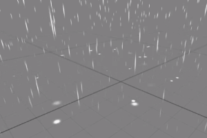

  

    

      <strong>Lumino</strong>
    

    

      <a class="github-link" href="https://github.com/LuminoEngine/Lumino">View in Github</a>
    

    

    Intuitive Framework for Real Time Graphics
    

    

      <a href="articles/documents/getting-started/getting-started.md" class="button"><i class="glyphicon glyphicon-send"></i>Get started</a>
      <!-- <a href="articles/downloads/index.md" class="button"><i class="glyphicon glyphicon-download"></i>Download Latest</a> -->
    

  

  

    

      

        <section>
          
Lumino はゲームやデジタルアートなどのインタラクティブアプリケーションを構築するためのオープンソースライブラリです。

          
2D/3Dシーンの描画をはじめとした一般的なタスクを抽象化し、シンプルなコードで多彩なインタラクションの実現をサポートします。

        </section>
      

    

  

  

    

      

        <i class="glyphicon glyphicon-wrench"></i>
        <section>
          <h2>開発状況と目標</h2>
          

            これまでは技術的な学習を目的とし、汎用的なゲームエンジンを目指して開発を進めてきました。ようやくその形が見えてきたところですが、今後より広く使えるライブラリとして展開するためにプロジェクトの目標を見直しています。→ 
            <a href="https://github.com/LuminoEngine/Lumino#%E9%96%8B%E7%99%BA%E7%8A%B6%E6%B3%81%E3%81%A8%E7%9B%AE%E6%A8%99">
              開発状況と目標
            </a>
          

        </section>
      

    

  

  

    

      

        <section>
          
          
          
        </section>
      

    

  

